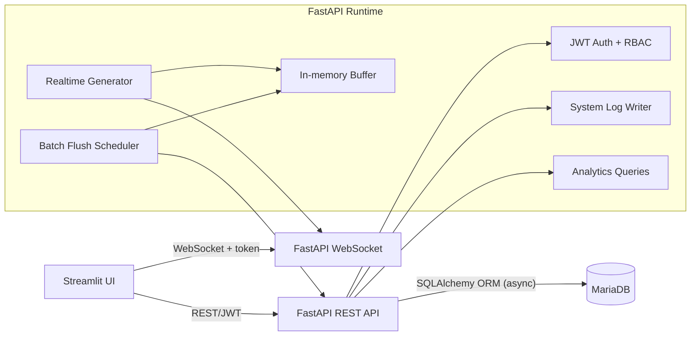

# Realtime Monitoring System (FastAPI + WebSocket + Streamlit + MariaDB)

## Project Overview

An end-to-end realtime data analytics and monitoring system with RESTful APIs, WebSocket streaming, and a multi-page Streamlit UI. The backend is fully async, uses SQLAlchemy ORM with MariaDB, and includes JWT authentication with role-based access control.

## Tech Stack

- Backend: FastAPI, SQLAlchemy ORM (asyncmy), Alembic, Pydantic, JWT (python-jose), Passlib (bcrypt)
- Database: MariaDB 11.7
- Frontend: Streamlit, Plotly, Pandas
- Infra: Docker, Docker Compose

## System Architecture



## Quick Start (Docker Compose)

1) Create `.env` from `.env.example` and keep it out of version control.

```bash
cp .env.example .env
```

2) Start the stack.

```bash
docker compose up --build
```

3) Access services.

- Streamlit UI: http://localhost:8501
- FastAPI Swagger: http://localhost:8000/docs

## Local Development (Optional, No Docker)

1) Create `.env` from `.env.example` and update values as needed.

```bash
cp .env.example .env
```

2) Start MariaDB and apply migrations.

```bash
cd backend
alembic upgrade head
```

3) Run the backend API.

```bash
uvicorn app.main:app --host 0.0.0.0 --port 8000
```

4) Run the frontend UI.

```bash
cd ../frontend
streamlit run streamlit_app.py
```

## API Documentation

Swagger UI: http://localhost:8000/docs

## Features

### User Management
- User registration and login (JWT)
- Roles: Admin, User, Viewer
- Role-based access control

### Data Management
- Create, read, update, delete records
- Pagination, filtering, sorting
- CSV import
- Excel export

### Realtime Monitoring
- Realtime data generator (1 record/sec)
- WebSocket push to clients
- Live charts with anomaly markers

### Analytics
- Summary statistics (count/avg/min/max)
- Category aggregation
- Time-range filtering

### Admin Tools
- User list and role updates
- System logs
- Runtime status and DB status

## Sample Data

CSV sample: `sample_data/records_sample.csv`

## Test Accounts (seeded, demo only)

Password: Password123! (change for production)

- admin@example.com (ADMIN)
- user@example.com (USER)
- viewer@example.com (VIEWER)
